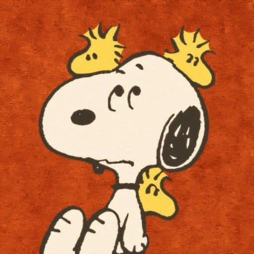

# 📦 Nome do Projeto

Breve descrição do projeto. Explique em 1–2 frases o que ele faz e qual o objetivo.

> Exemplo: Interface web responsiva desenvolvida com Bootstrap para gerenciamento de tarefas.

---

## 🚀 Tecnologias Utilizadas

- HTML5  
- CSS3  
- JavaScript  
- Bootstrap (versão X.X)  

---

## 📸 Demonstração



---

## ⚙️ Como Executar

1. Clone o repositório:
```bash
git clone https://github.com/Pedro1Porto/Bootstrap-Avan-ado